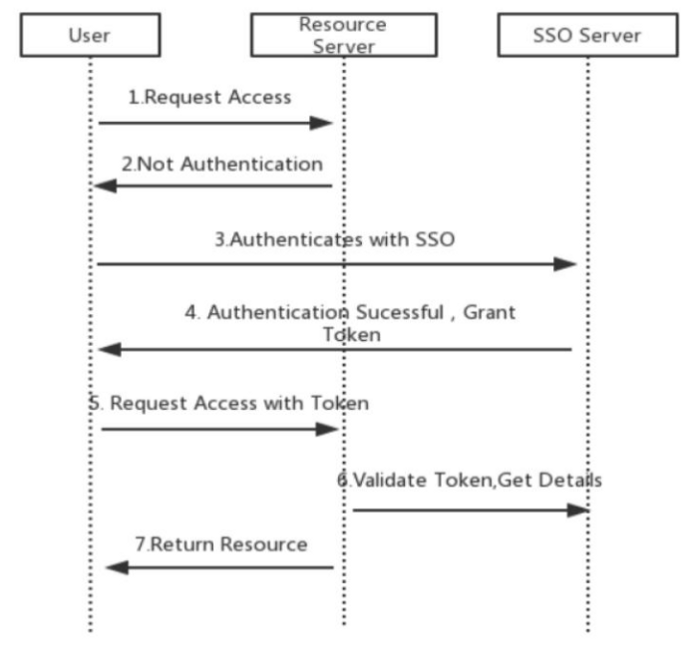

### Session, cookie, JWT, token, SSO, and OAuth 2.0

These are various mechanism to maintain the user identity (**Authentication**)

**Authentication** verifies the identity of a user or service, and   
**Authorization** determines their access rights. 


Consider a website login, eg gmail, which takes in UserName and Password. This is the **HTTP Basic Authentication**

This once validated, uses the **Session + Cookie mechanism** to maintain the login.  
The server stores the **Session**, while the browser stores the SessionID in a Cookie which is sent with each request.

**Cookies** are mainly used for three purposes:
* Session management: Logins, shopping carts, game scores, or anything else the server should remember
* Personalization: User preferences, themes, and other settings
* Tracking: Recording and analyzing user behavior

### Cookies
After receiving an HTTP request, a server can send one or more _Set-Cookie headers_ with the response. The browser usually stores the cookie and sends it with requests made to the same server inside a _Cookie HTTP header_  
The server can specify an expiration date or time period after which the cookie shouldn't be sent. 

eg. Consider the following server response
```text
HTTP/2.0 200 OK
Content-Type: text/html
Set-Cookie: id=a3fWa; Expires=Thu, 21 Oct 2021 07:28:00 GMT; Secure; HttpOnly
```
This specifies
* The Cookie with id=a3fWa will send on each subsequent request till expiry
* With the Expires date and time, the cookie will be expired relative to the client time, not the server
* A cookie with the Secure attribute is only sent to the server with an encrypted request over the HTTPS protocol. It's never sent with unsecured HTTP (except on localhost), which means man-in-the-middle attackers can't access it easily
* A cookie with the HttpOnly attribute is inaccessible to the JavaScript Document.cookie API; it's only sent to the server. For example, cookies that persist in server-side sessions don't need to be available to JavaScript and should have the HttpOnly attribute. This precaution helps mitigate cross-site scripting (XSS) attacks.

This mechanism worked well in the pre-mobile world, when we mainly used browsers to access the internet.  
However, with the advent of mobile computing, a better mechanism was needed, since we have applications other than browsers making HTTP requests.  
Enter Tokens

### Tokens
The server could generate a token that has the claim eg "logged in as administrator" and provide that to a client.  
The client could then use that token to prove that it is logged in as admin. 

The tokens can be signed by server's private key, so that the server decrypts and verifies that the token is legitimate.  
However, if client wants to verify the token's legitimacy, it can use the public key, if available.

From what we see above, each server can have its own mechanism to encrypt tokens. A standardization was needed.  
Enter JWT

### JWT Tokens (JSON Web Tokens)
JWT is a standard way of representing tokens. This information can be verified and trusted because it is digitally signed. Since JWT contains the signature, there is no need to save session information on the server side.

#### JWT Structure

**Header**  
Identifies which algorithm is used to generate the signature
```
{
  "alg": "HS256",
  "typ": "JWT"
}
```
typical cryptographic algorithms used are HMAC with SHA-256 (HS256) and RSA signature with SHA-256 (RS256).

**Payload**
```{
  "loggedInAs": "admin",
  "iat": 1422779638
}
```
Contains a set of claims. eg, Issued At Time claim (iat) and a custom claim (loggedInAs).

**Signature**   
Securely validates the token. The signature is calculated by encoding the header and payload using Base64url Encoding and concatenating the two together with a period separator. That string is then run through the cryptographic algorithm specified in the header.
```
HMAC_SHA256(
  secret,
  base64urlEncoding(header) + '.' +
  base64urlEncoding(payload)
)
```
The three parts are encoded separately using Base64url Encoding, and concatenated using periods to produce the JWT:
```
const token = base64urlEncoding(header) + '.' + base64urlEncoding(payload) + '.' + base64urlEncoding(signature)
```

In authentication, when the user successfully logs in using their credentials, a JSON Web Token will be returned and must be saved locally (typically in local or session storage, but cookies can also be used), instead of the traditional approach of creating a session in the server and returning a cookie. 


As we are living in microservices world, the services also need to authenticate/authorize between each other


With JWT, the microservice has to perform two steps mainly
* **Generating the JSON Web Token** This is the authentication part, where in the user is validated, and the payload is added with user id, expiration date etc and also user roles and user-defined information.
* **Validating the token for received requests** This is the authorization part, where the Base64 JWT token is decrypted, expiry checked, and the request is not processed based on the user id and roles in the token

Now our API or the server still has to maintain a user credentials database. Each user of our website/app has to sign up, the server needs to secure the password of the user, rotate password, etc. 

Enter Single Sign-On 

# Single Sign-On (SSO)
We can also leverage Single Sign-on instead of JWT, where in the user authenticated with a third-party SSO server, and passes in the token to our service.  
The service in turn validates the token with the SSO server before granting access.  
Needless to say, this results in a lot of trivial network traffic, repeated work, and it may cause single point of failure.



Single sign-on (SSO) has evolved quietly into federated authentication. Federated authentication streamlines user login credentials across multiple platforms and applications to simplify the sign-in process while enhancing security.

Security Assertion Markup Language (SAML) and Open Authorization (OAuth) have emerged as the go-to technologies for federated authentication. While SAML is an Extensible Markup Language (XML)-based standard, OAuth is based on JavaScript Object Notation (JSON), binary, or even SAML formats.

### OAuth (Open Auth)
OAuth is a technical standard for **authorizing users** (NOTE: authorizing, not authentication). It is a protocol for passing authorization from one service to another without sharing the actual user credentials, such as a username and password. With OAuth, a user can sign in on one platform and then be authorized to perform actions and view data on another platform.  
OAuth is one of the most common methods used to pass authorization from a single sign-on (SSO) service to another cloud application

OAuth is not the same thing as Single Sign On (SSO). While they have some similarities — they are very different.

OAuth is an authorization protocol. SSO is a high-level term used to describe a scenario in which a user uses the same credentials to access multiple domains

#### How OAuth authorization tokens work?

Suppose Alice wants to access her company's cloud file storage application. She will
1. first sign into her company's SSO
2. When she opens up the file storage application, instead of simply letting her in, the application requests authorization for Alice from her SSO.
3. In response, the SSO sends an **OAuth authorization token** to the application. The token contains information about what privileges Alice should have within the application. The token will also have a time limit: after a certain amount of time, the token expires and Alice will have to sign in to her SSO again.

### SAML (Security Assertion Markup Language)
SAML is a standardized way to tell external applications and services that a user is who they say they are. SAML makes single sign-on (SSO) technology possible by providing a way to authenticate a user once and then communicate that authentication to multiple applications. The most current version of SAML is SAML 2.0.
**SAML is for User Authentication, OAuth is for User Authorization** 
